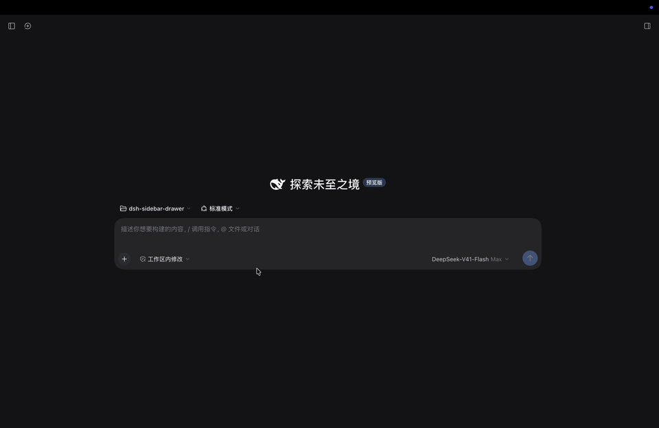

# dsh-sidebar-drawer

[English](README.en.md) | 简体中文

左侧栏边缘抽屉：侧栏收起时，把鼠标移到**屏幕最左边 10px 内并停留 500ms** 就会抽出侧栏；鼠标停在抽屉里期间一直保持抽出；鼠标离开抽屉后自动收回。

一个纯浏览器行为插件（Host 半边是空的），只借用 DSH 自己的侧栏开合，不改动任何内置文件。



## 它会做什么

- **停留才算数** —— 指针要在左侧 10px 内连续待够 500ms 才抽出；扫过边缘不会误触。
- **在抽屉里就保持** —— 指针停在抽屉内（阅读、点击、停留）期间一直抽出，不催你。
- **动画期不打断** —— 开合过渡进行中绝不发第二次开合，所以不会跳变，也不会突然消失。
- **滑动而不是跳变** —— 出厂 frame 是"先写列宽、后发布过渡标记"，直接开合会瞬变（收回看起来
  就是一下子消失）；插件在请求开合前先把框架自己的标记预置上，所以抽出与收回都真的滑动。
- **手开的侧栏不碰** —— 你用按钮、Cmd+B 或拖拽调宽开出来的侧栏（手开），插件完全不碰、从不收回。
- **让路** —— 拖拽列宽、窗口失焦、页面滚动都有对应的让路逻辑。

逐条场景、状态机不变量与已知缺口见 **[docs/behavior.md](docs/behavior.md)**。

## 安装

这是一个 DSH **plugin bundle**：包内自带 `cordis.patch.yml`，`package.json` 里声明了
`dsh.bundle.patch`，所以它由 Plugin Manager 安装并托管挂载行 —— **不需要你手改 profile 的补丁文件**。

```bash
# 从 npm 安装（推荐，带版本钉住）
dsh plugin --profile desktop add dsh-sidebar-drawer@0.1.1

# 从 GitHub 安装（同样钉住版本，走仓库的 v0.1.1 tag）
dsh plugin --profile desktop add "github:1dustycy/dsh-sidebar-drawer#v0.1.1"

# 跟随 main 最新提交（便于拿到最新行为改动）
dsh plugin --profile desktop add github:1dustycy/dsh-sidebar-drawer

# 从本地目录安装（开发用：写入 link: 依赖，改动即时生效）
dsh plugin --profile desktop add /path/to/dsh-sidebar-drawer
```

把 `desktop` 换成你要装的 profile 名（如 `web`、`tui`）。这条命令做两件事：把包装进
`~/.dsh/profiles/<name>/package.json` 的 `dependencies`，并把 `dsh-sidebar-drawer` 加进该 profile 的
`dsh.profile.bundles`。装完后**刷新页面**即可生效，不需要重启 App（客户端半边由 bundle 的 mtime
轮询 + `/plugins/events` 热加载）。

卸载：

```bash
dsh plugin --profile desktop remove dsh-sidebar-drawer
```

> 为什么不直接往 profile 的 `cordis.patch.yml` 里加一行？那是与其他会话共享的文件，被覆盖时
> 症状是插件"装了但没生效"，且从插件自身看不出任何异常。理由见
> [ADR-0003](docs/adr/0003-bundle-patch-ownership.md)。

**要求**：DSH Desktop（或任何带 Web GUI 的 profile）。客户端半边注入
`@deepseek-ai/dsh-client-ui-layout`，所以目标 profile 必须已挂载 Web 布局 bundle。
`peerDependencies` 为 `@deepseek-ai/cordis >=4.0.4 <5` —— 从 registry 安装时 Plugin Manager 会先
核对这一条，不兼容就在下载之前拒绝。

## 开发与验证

```bash
node test/client.test.mjs    # 单元套件：vm + DOM 替身 + 会推进的虚拟时钟，不需要浏览器
node test/browser.test.mjs   # 浏览器套件：真实 Chromium + CDP 真实鼠标事件与真实 CSS 动画
npm test                     # 依次跑上面两套
node tools/probe.mjs         # 诊断工具：打印一次边缘停留的决策轨迹
npm pack --dry-run           # 确认发布内容
```

改 `lib/client.js` 后**刷新页面**即可生效（前提是 profile 的 `hmr` 行处于启用状态，桌面 profile 默认启用）。

`test/browser.test.mjs` 自带 HTTP 服务与浏览器进程，跑完即退出；需要本机有 Chromium（找不到会自动跳过）。
`SHOT=<路径> node test/browser.test.mjs` 会把最后"抽屉打开"的画面存成 PNG（`docs/harness-open.png`
即由此生成）。顶部那张动图反过来 —— 它是**真实 GUI 的屏幕录制**，不是夹具 —— 用
`node tools/demo-gif.mjs <录屏文件>` 重新生成，需要本机有 ffmpeg。`test/harness.html` 是内置三栏
框架的等价复刻，用浏览器直接打开并加 `?plugin=<client.js 的 URL>` 也能手工试。

> **改测试夹具前请先读** [docs/implementation.md](docs/implementation.md#测试夹具必须与出厂契约同步)。
> 两套夹具必须精确建模出厂 shell 的锚点契约：夹具一旦把条件锚点写成常驻，就会在一个已损坏的
> bundle 上全绿 —— 本插件正是这样发布过一个"指针停在边缘不动就无限开合"的缺陷。

## 文档

| 文档 | 内容 |
|---|---|
| [docs/behavior.md](docs/behavior.md) | 行为规格：逐条场景、状态机不变量、已知缺口 |
| [docs/implementation.md](docs/implementation.md) | 实现要点：出厂锚点契约、判定逻辑、可调参数 |
| [docs/adr/](docs/adr/) | 决策记录（为什么这样做） |
| [CONTEXT.md](CONTEXT.md) | 术语表：中文措辞与代码标识符的对应 |

## 许可

MIT
